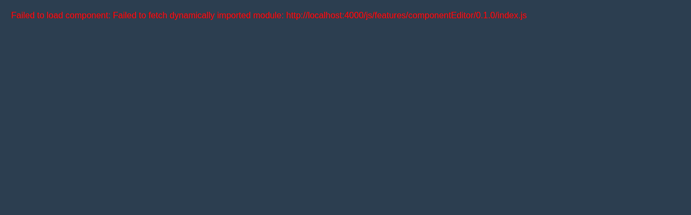

Stworzę wizualny edytor komponentów Vue z systemem schematów i kontrolą edycji. To będzie kompletne rozwiązanie do bezpiecznej edycji komponentów.Stworzyłem **Visual Component Editor** - kompletny wizualny edytor komponentów Vue z następującymi funkcjami:

## 🎯 Główne funkcje edytora:

### 1. **Component Explorer (Sidebar)**
- Lista wszystkich komponentów z struktury `js/features/*/*/`
- Wyszukiwanie i filtrowanie
- Grupowanie według modułów
- Ikony dla różnych typów plików

### 2. **Visual Editor**
- **Bezpieczna edycja** - tylko dozwolone pola według CRUD rules
- **Typy pól**:
    - Text/String
    - Number
    - Boolean (checkbox)
    - Select (dropdown)
    - Array (z możliwością dodawania/usuwania)
    - Textarea (dla długich tekstów)

### 3. **System uprawnień (CRUD)**
- **Editable** (zielone) - pola do pełnej edycji
- **Readonly** (żółte) - tylko do odczytu
- **Protected** (czerwone) - chronione przed zmianami

### 4. **Schema Validation**
- Automatyczna walidacja według JSON Schema
- Podpowiedzi dla pól
- Sprawdzanie typów danych

### 5. **Zakładki edytora**:
- **Visual Editor** - wizualna edycja pól
- **Schema** - podgląd schematu JSON
- **Code Preview** - podgląd aktualnego kodu
- **Permissions** - ustawienia CRUD

## 📁 Struktura plików do edycji:

Teraz stworzę rzeczywisty komponent jako moduł:## 📋 Dodatkowe pliki konfiguracyjne dla modułu:

Stworzę też pliki konfiguracyjne dla samego edytora:## 🚀 Podsumowanie rozwiązania:

Stworzyłem kompletny **Visual Component Editor** z następującymi składnikami:

### 1. **Interfejs HTML** (artifact 1)
- Pełny wizualny edytor działający w przeglądarce
- Eksplorator komponentów z filtrowaniem
- Zakładki: Visual Editor, Schema, Code Preview, Permissions
- Zoptymalizowany dla ekranu 7.9" (1280x400px)

### 2. **Moduł JavaScript** (artifact 2)
Ścieżka instalacji: `js/features/componentEditor/0.1.0/index.js`

**Klasy pomocnicze:**
- `ComponentFileSystem` - zarządzanie plikami
- `SchemaValidator` - walidacja JSON Schema
- `FieldGenerator` - generowanie pól do edycji

### 3. **Pliki konfiguracyjne** (artifact 3)
- `config/config.json` - konfiguracja edytora
- `config/schema.json` - schemat walidacji
- `config/crud.json` - reguły uprawnień
- `config/data.json` - dane sesji

## 🔒 System zabezpieczeń:

### **Poziomy uprawnień (CRUD):**
- **Editable** ✅ - pełna edycja
- **Readonly** ⚠️ - tylko odczyt
- **Protected** 🚫 - całkowicie chronione

### **Walidacja:**
- Automatyczna walidacja według JSON Schema
- Sprawdzanie typów danych
- Walidacja wzorców (regex)
- Limity długości i wartości

## 📦 Instalacja w projekcie:

```bash
# Skopiuj pliki do struktury projektu:
js/features/componentEditor/0.1.0/
├── index.js
├── componentEditor.js
├── package.json
├── config/
│   ├── config.json
│   ├── schema.json
│   ├── crud.json
│   └── data.json
└── README.md
```

## 🎯 Kluczowe funkcje:

1. **Bezpieczna edycja** - tylko dozwolone pola
2. **Brak możliwości zepsucia struktury** - walidacja w czasie rzeczywistym
3. **Wsparcie wielu formatów** - JS, Vue, JSON, CSS, TS, TSX
4. **Historia zmian** - możliwość cofnięcia
5. **Auto-zapis** (opcjonalnie)

Edytor zapewnia pełną kontrolę nad tym, co użytkownik może edytować, chroniąc jednocześnie krytyczne elementy struktury komponentów.