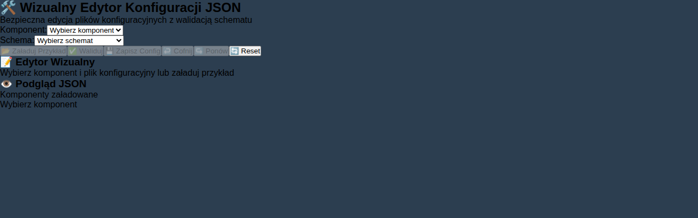

# JSON Editor Component

Visual JSON configuration editor with schema validation for MASKSERVICE component configuration files.

## 📋 Component Information

- **Name**: `jsonEditor`
- **Version**: `0.1.0`
- **Type**: Utility Tool
- **Category**: Configuration Editor
- **Framework**: Vue 3

## 🎯 Purpose

The JSON Editor component provides a visual interface for editing component configuration files (`js/features/*/*/config/*.json`) with schema validation, making it safe and easy to modify component settings without manual JSON editing.

## ✨ Features

### Core Functionality
- **Visual JSON Editing** - Tree-based interface for JSON manipulation
- **Schema Validation** - Built-in validation for supported configuration schemas
- **Component Integration** - Direct loading of component config files
- **Multi-file Support** - Edit config.json, data.json, schema.json, crud.json
- **Real-time Preview** - Live JSON preview with syntax highlighting
- **Import/Export** - Load and save JSON files

### Supported Schemas
- **App Configuration** - API URLs, connection settings
- **Menu Structure** - Role-based menu definitions
- **Router Settings** - Navigation and view configuration
- **System Configuration** - Security and system parameters
- **Test Scenarios** - Device testing configurations
- **Workshop Management** - Parts and tools management

### Safety Features
- **Read-only Fields** - Critical fields protected from editing
- **Validation Rules** - Ensures data integrity
- **Backup System** - Automatic backups before saving
- **Error Handling** - Clear error messages and recovery

## 🚀 Quick Start

### Standalone Usage
```bash
# Start the JSON Editor development server
npm run component:dev:jsonEditor

# Open browser at http://localhost:3009
```

### Integration in Other Components
```javascript
import JsonEditorModule from './path/to/jsonEditor/index.js';

// Initialize the component
const result = await JsonEditorModule.init({ store });

// Use in Vue app
app.component('json-editor', result.component);
```

## 📖 Usage Examples

### Example 1: Edit AppFooter Configuration
```html
<!-- Load the component -->
<json-editor ref="editor" />

<script>
export default {
  mounted() {
    // Configure for appFooter editing
    this.$refs.editor.selectedComponent = 'appFooter';
    this.$refs.editor.selectedConfigFile = 'config.json';
    this.$refs.editor.selectedSchema = 'app';
    this.$refs.editor.loadSampleData();
  }
}
</script>
```

### Example 2: Edit Menu Structure
```javascript
// Programmatic configuration
const editor = this.$refs.jsonEditor;
editor.selectedComponent = 'mainMenu';
editor.selectedConfigFile = 'config.json'; 
editor.selectedSchema = 'menu';

// Load existing config
await editor.loadComponentConfig();

// The editor will display menu structure for all roles:
// OPERATOR, ADMIN, SUPERUSER, SERWISANT
```

### Example 3: Custom JSON Editing
```javascript
// Load custom JSON file
const fileInput = document.createElement('input');
fileInput.type = 'file';
fileInput.accept = '.json';
fileInput.onchange = (e) => {
  const file = e.target.files[0];
  editor.importJSON(file);
};
fileInput.click();
```

## 🎮 Interactive Demo

Open `example-usage.html` in a browser to see interactive scenarios:

1. **AppFooter Config** - Edit footer display settings
2. **MainMenu Config** - Manage role-based menu items
3. **System Settings** - Modify system parameters
4. **Custom JSON** - Free-form JSON editing

## ⚙️ Configuration

### Component Settings (`config/config.json`)
```json
{
  "settings": {
    "defaultSchema": "app",
    "autoSave": false,
    "validateOnChange": true,
    "theme": "light"
  },
  "ui": {
    "showPreview": true,
    "showValidation": true,
    "splitView": true
  },
  "security": {
    "readOnlyMode": false,
    "maxFileSize": 1048576,
    "backupOnSave": true
  }
}
```

### Available Schemas
- `app` - Application configuration (API_URL, WS_URL, MOCK_MODE)
- `menu` - Menu structure for user roles
- `router` - Routing and navigation settings
- `system` - System security and sensor configuration
- `test-scenarios` - Device testing parameters
- `workshop` - Parts and tools management

## 🔧 API Reference

### Main Methods

#### `loadComponentConfig(component, file)`
Loads configuration file for specified component.

```javascript
await editor.loadComponentConfig('appFooter', 'config.json');
```

#### `saveComponentConfig(component, file, data)`
Saves configuration data to component file.

```javascript
await editor.saveComponentConfig('appFooter', 'config.json', configData);
```

#### `validateJSON(data, schema)`
Validates JSON data against schema.

```javascript
const result = editor.validateJSON(data, schema);
if (result.success) {
  console.log('Valid JSON');
} else {
  console.error('Validation error:', result.error);
}
```

#### `exportJSON(data, filename)`
Exports JSON data to file.

```javascript
editor.exportJSON(configData, 'my-config.json');
```

### Events

- `config-loaded` - Fired when configuration is loaded
- `config-saved` - Fired when configuration is saved
- `validation-complete` - Fired after validation
- `error` - Fired on errors

## 🧪 Testing

```bash
# Run component tests
npm run test

# The test suite covers:
# - Component initialization
# - JSON validation
# - Schema validation  
# - Import/export functionality
# - Error handling
```

## 🎨 Styling

The component is optimized for 7.9" display (1280x400px) and includes:

- **Responsive Design** - Adapts to different screen sizes
- **Dark/Light Themes** - Theme switching support
- **Accessibility** - ARIA labels and keyboard navigation
- **Touch Support** - Works with touch interfaces

### CSS Classes
- `.json-editor-container` - Main container
- `.editor-panel` - Left editing panel
- `.preview-panel` - Right preview panel
- `.json-tree` - Tree view structure
- `.json-key` / `.json-value` - Individual JSON elements

## 🔒 Security Considerations

### Protected Fields
Some configuration fields are protected from editing:
- Component name and version
- Critical system paths
- Security tokens and keys

### Validation Rules
- Required field validation
- Data type validation
- Business rule validation
- Maximum file size limits

### Backup System
- Automatic backups before saving
- Configurable backup retention
- Recovery from backup files

## 🐛 Troubleshooting

### Common Issues

1. **Component not loading**
   - Check file paths in import statements
   - Verify Vue 3 and Vuex 4 are loaded
   - Check browser console for errors

2. **Schema validation failing**
   - Verify schema is selected
   - Check required fields are present
   - Validate JSON syntax

3. **Config file not saving**
   - Check write permissions
   - Verify component path exists
   - Check file size limits

### Debug Mode
Enable debug logging:
```javascript
window.JSON_EDITOR_DEBUG = true;
```

## 📁 File Structure

```
js/features/jsonEditor/0.1.0/
├── index.js              # Main module export
├── jsonEditor.js          # Vue component
├── jsonEditor.css         # Component styles
├── jsonEditor.test.js     # Unit tests
├── package.json           # Component package
├── standalone.html        # Standalone demo
├── example-usage.html     # Usage examples
├── README.md              # This documentation
└── config/                # Configuration files
    ├── config.json        # Component settings
    ├── data.json          # Runtime data
    ├── schema.json        # Validation schema
    └── crud.json          # CRUD operations
```

## 🔄 Updates & Changelog

### Version 0.1.0 (Current)
- Initial release
- Basic JSON editing functionality
- Schema validation support
- Component integration
- Multi-file editing
- Import/export capabilities

## 📞 Support

For issues and questions:
1. Check the troubleshooting section
2. Review the example usage
3. Check the test suite for expected behavior
4. Create an issue in the project repository

---

**MASKSERVICE C20 1001 JSON Editor Component**  
*Visual configuration editing for industrial control systems*
