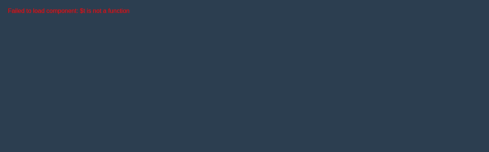

# ReportsViewer

Advanced reports viewer with filters, data visualization and export capabilities

## 📋 Component Information

- **Name**: `reportsViewer`
- **Version**: `0.1.0`
- **Type**: `component`
- **Category**: `ui-component`
- **Status**: 🟡 **Nearly Complete**

## 🚀 Quick Start

### Development Server
Run this component in isolation for development and testing:

```bash
# Start dev server for this component
npm run component:dev:reportsViewer

# Or manually with custom port
node tools/dev/componentDevServer.js js/features/reportsViewer/0.1.0 3001
```

**Available URLs:**
- 🏠 Component: http://localhost:3001
- 🎮 Demo: http://localhost:3001/demo  
- ⚙️ Admin: http://localhost:3001/admin
- 📊 API: http://localhost:3001/api/info

### Integration Usage
```javascript
import reportsViewer from './js/features/reportsViewer/0.1.0/index.js';

// Initialize component
const result = await reportsViewer.init(context);

// Use component
if (reportsViewer.component) {
  // Vue component available
  const VueComponent = reportsViewer.component;
}

// Handle actions
const response = reportsViewer.handle({
  action: 'render',
  data: { /* your data */ }
});
```

## 📁 Project Structure

```
reportsViewer/
├── 0.1.0/
│   ├── index.js                 # Main module export
│   ├── reportsViewer.js              # Vue component ✅
│   ├── reportsViewer.test.js         # Component tests ❌
│   ├── package.json            # Module metadata
│   ├── config/                 # Configuration directory
│   │   ├── config.json         # Main configuration
│   │   ├── data.json           # Runtime data
│   │   ├── schema.json         # Validation schema  
│   │   └── crud.json           # Edit rules
│   ├── CHANGELOG.md            # Version history
│   ├── TODO.md                 # Development tasks
│   └── README.md               # This file
```

## ⚙️ Configuration

### Main Config (`config/config.json`)
Configuration sections:

#### `metadata`
Metadata configuration
- Key properties: `name`, `version`, `type`, ...

#### `ui`
User interface settings and styling
- Key properties: `layout`, `colors`, `animations`

#### `reportFilters`
ReportFilters configuration
- Key properties: `dateRange`, `deviceTypes`, `testStatuses`

#### `exportFormats`
ExportFormats configuration
- Key properties: `0`, `1`, `2`, ...

#### `api`
API connection configuration
- Key properties: `endpoints`, `timeout`, `retryAttempts`

#### `performance`
Performance and optimization settings
- Key properties: `maxReportSize`, `cacheTimeout`, `maxExportSize`, ...

#### `security`
Security and validation rules
- Key properties: `requiredRole`, `allowedExportFormats`, `maxDateRange`, ...

#### `chartConfiguration`
ChartConfiguration configuration
- Key properties: `defaultType`, `colors`, `animations`, ...

#### `localization`
Localization configuration
- Key properties: `supportedLanguages`, `fallbackLanguage`, `dateFormats`


### Runtime Data (`config/data.json`)
Editable runtime values that can be modified without code changes.

### Schema (`config/schema.json`)
JSON Schema for configuration validation - auto-generated from config structure.

### CRUD Rules (`config/crud.json`)
Defines which fields are editable, readonly, or protected in admin interfaces.

## 🔧 Development

### Local Testing
```bash
# Run component tests
npm test -- reportsViewer.test.js

# Validate configuration
npm run module:validate reportsViewer

# Update schemas after config changes
npm run config:generate-components
```

### Configuration Updates
1. Edit `config/config.json` for structural changes
2. Edit `config/data.json` for runtime value updates  
3. Run `npm run config:generate-components` to update schemas
4. Test changes with `npm run component:dev:reportsViewer`

### Manual Schema Edits
To preserve manual schema changes:
```json
{
  "_manual": true,
  "_modified": "2025-01-27T10:00:00Z",
  "_comment": "Custom validation rules",
  // your manual schema...
}
```

## 🎛️ Admin Interface

Access the admin interface at http://localhost:3001/admin when running dev server:

- **Config Editor**: Edit runtime data with live validation
- **Schema Viewer**: View current validation rules  
- **Reset Tools**: Restore default configurations
- **Export/Import**: Backup and restore configurations

## 📊 API Endpoints

When running the dev server, these API endpoints are available:

| Endpoint | Method | Description |
|----------|---------|-------------|
| `/api/info` | GET | Component information |
| `/api/config` | GET | Full configuration |
| `/api/data` | GET | Runtime data only |
| `/api/data` | POST | Update runtime data |
| `/api/reset` | POST | Reset to defaults |

### API Usage Examples
```javascript
// Get component info
const info = await fetch('http://localhost:3001/api/info').then(r => r.json());

// Get current data
const data = await fetch('http://localhost:3001/api/data').then(r => r.json());

// Update data
const updated = await fetch('http://localhost:3001/api/data', {
  method: 'POST',
  headers: { 'Content-Type': 'application/json' },
  body: JSON.stringify({ key: 'newValue' })
}).then(r => r.json());
```

## 🧪 Testing


### Tests Status
❌ Tests not yet implemented

To add tests:
1. Create `reportsViewer.test.js`
2. Use Vitest framework
3. Test component initialization, config validation, and API responses


## 🔍 Dependencies

- `vue`
- `vuex`

## 🛠️ Troubleshooting

### Common Issues

| Issue | Solution |
|-------|----------|
| Dev server won't start | Check port availability, run `npm install` |
| Config validation fails | Check `config/schema.json`, validate JSON syntax |
| Component not loading | Verify `index.js` exports, check browser console |
| API calls fail | Ensure dev server is running, check CORS settings |

### Debug Commands
```bash
# Validate component structure
npm run module:validate reportsViewer

# Check configuration
npm run config:validate

# View component info
curl http://localhost:3001/api/info

# Test API endpoints
curl http://localhost:3001/api/data
```

## 📝 Changelog

See `CHANGELOG.md` for version history and updates.

## 🎯 TODOs

See `TODO.md` for pending development tasks.

---

**Generated**: 2025-09-27T07:16:41.998Z  
**Generator**: componentReadmeGenerator v1.0.0  
**Component**: reportsViewer@0.1.0
